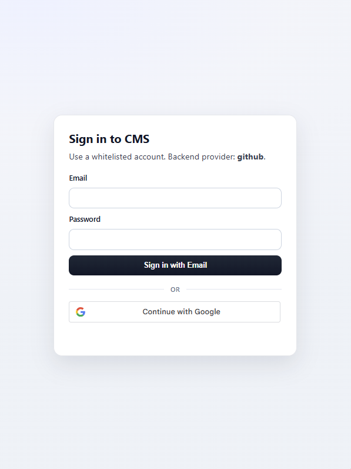
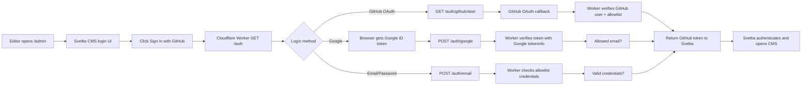

# Google + GitHub + Email Auth for Sveltia CMS

Custom auth backend for Sveltia CMS using:

- Google Identity Services (allowlisted emails)
- GitHub OAuth (allowlisted GitHub logins/emails)
- Email/password (allowlist with hash or plain password)

No database is required. On successful auth, the Worker returns a GitHub token to Sveltia CMS.

## Screenshots



## System flow



## Project structure

- `worker.js`: Cloudflare Worker auth server
- `wrangler.toml`: Worker config
- `.dev.vars.example`: local env template
- `admin/index.astro`: Sveltia CMS entry point with official manual customization (no DOM injection)

## Setup

### 1) Google OAuth client

Create a **Web application** OAuth client in Google Cloud Console.

- Authorized JavaScript origins:
  - `http://127.0.0.1:8787`
  - `https://<your-worker-subdomain>.workers.dev`
- Authorized redirect URIs:
  - none for this implementation

Use the generated client ID as `GOOGLE_CLIENT_ID`.

### 2) Configure environment variables

Copy `.dev.vars.example` to `.dev.vars` for local development and fill values.

Required:

- `GITHUB_PAT`: token returned to Sveltia after successful auth

Recommended:

- `GOOGLE_CLIENT_ID`: Google OAuth client ID
- `GOOGLE_CLIENT_IDS`: comma-separated allowed audiences (can match `GOOGLE_CLIENT_ID`)
- `ALLOWED_GOOGLE_EMAILS`: exact allowed Google emails
- `GITHUB_OAUTH_CLIENT_ID`: GitHub OAuth App client ID (for direct GitHub OAuth button)
- `GITHUB_OAUTH_CLIENT_SECRET`: GitHub OAuth App client secret
- `GITHUB_OAUTH_REDIRECT_URI`: optional override (default: `https://<worker-domain>/auth/github/callback`)
- `ALLOWED_GITHUB_LOGINS`: comma-separated GitHub username allowlist
- `ALLOWED_GITHUB_EMAILS`: comma-separated GitHub email allowlist
- `EMAIL_PASSWORD_USERS`: allowlisted email/password entries (plain or SHA-256)
- `ALLOWED_DOMAINS`: optional `site_id` allowlist for `/auth`

`EMAIL_PASSWORD_USERS` formats:

- JSON object: `{"editor@gmail.com":"plainPasswordOrSha256"}`
- JSON array: `[{"email":"editor@gmail.com","password":"plainPassword"}]` or `[{"email":"editor@gmail.com","passwordSha256":"<sha256_hex>"}]`
- CSV: `editor@gmail.com:plainPassword,other@gmail.com:<sha256_hex>`
- Optional explicit plain marker: `plain:myPassword`

Notes:

- If value is a 64-char hex string, it is treated as SHA-256.
- Any other value is treated as plain password and hashed internally at login.
- For production, hashed values are recommended so plain secrets are not stored in env vars.

Generate SHA-256:

```bash
node -e 'const c=require("crypto");console.log(c.createHash("sha256").update(process.argv[1]).digest("hex"))' "YourStrongPassword"
```

### 3) Run locally

```bash
npx wrangler dev
```

Test endpoints:

- `http://127.0.0.1:8787/auth?provider=github`
- `http://127.0.0.1:8787/health`

### 4) Deploy

```bash
npx wrangler deploy
```

Set production secrets/vars in Cloudflare (Dashboard or Wrangler), especially `GITHUB_PAT`.

### 5) Prevent env vars from being wiped on GitHub deploys

Cloudflare can overwrite Worker vars during deploy if not configured to keep existing values.

- `wrangler.toml` now includes `keep_vars = true` to preserve dashboard vars across deploys.
- Keep secrets in Cloudflare Worker Secrets (`wrangler secret put ...`) instead of plain text vars.
- If you deploy environments (for example `--env production`), set secrets/vars for that exact environment too.
- Do not rely on `.dev.vars` for production; it is local development only.

Quick verify after deploy:

```bash
npx wrangler secret list
```

## Sveltia config

In your CMS config (`config.yml`):

```yml
backend:
  name: github
  repo: owner/repo
  branch: main
  base_url: https://<your-worker-subdomain>.workers.dev
  auth_endpoint: /auth
```

## `admin/index.astro`

This project uses Sveltia's official customization path instead of DOM/button injection:

- custom mount element: `<div id="nc-root"></div>`
- manual init: `window.CMS_MANUAL_INIT = true`
- JavaScript API init:
  - `site_url`
  - `logout_redirect_url`
  - `logo`

Minimal pattern:

```html
<div id="nc-root"></div>
<script>window.CMS_MANUAL_INIT = true;</script>
<script src="https://unpkg.com/@sveltia/cms/dist/sveltia-cms.js"></script>
<script>
  CMS.init({
    config: {
      site_url: "https://example.com",
      logout_redirect_url: "https://example.com/logged-out",
      logo: { src: "/path/to/logo.png", show_in_header: true },
    },
  });
</script>
```

Authentication customization still happens in the Worker page (`/auth`) via `backend.base_url` + `backend.auth_endpoint`.
`CMS.init({ config })` is used for overrides and still expects your normal CMS config file (for backend/collections) unless you pass a full config object with `load_config_file: false`.

## Endpoints

- `GET /auth` and `GET /oauth/authorize`: render auth page
- `GET /auth/github/start`: start GitHub OAuth
- `GET /auth/github/callback`: handle GitHub OAuth callback + allowlist
- `POST /auth/google`: validate Google ID token and allowlist
- `POST /auth/email`: validate email/password against allowlist (hash or plain)
- `GET /health`: health check
